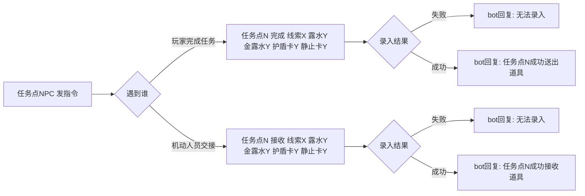

# 任务点 NPC 指南

> 你是任务点 NPC。在**工作群**发指令，系统校验录入并回复。
> 指令格式以本指南为准；通用格式约定见《通用指令规则》。

## 1. 你的职责

- 在固定任务点值守，处理两类上报：
  - **玩家完成任务** → 用「完成」指令送出道具
  - **机动人员交接掉落道具** → 用「接收」指令入库道具

## 2. 指令一览

### 2.1 玩家完成任务（送出道具）

```
任务点N 完成 线索X 露水Y 金露水Z 护盾卡Z 静止卡Z
```

例：`任务点3 完成 线索5 露水2 金露水0 护盾卡1 静止卡0`

### 2.2 机动人员交接（入库道具）

```
任务点N 接收 线索X 露水Y 金露水Z 护盾卡Z 静止卡Z
```

例：`任务点3 接收 线索5 露水2 金露水0 护盾卡1 静止卡0`

> 字段说明：N = 任务点编号，X = 线索编号（或「无」），Y / Z = 数量（或「无」）。顺序固定，空缺用「无」。

## 3. 指令流程图



## 4. bot 回复

| 情形 | bot 回复 |
| --- | --- |
| 录入成功（完成） | `任务点N成功送出道具` |
| 录入成功（接收） | `任务点N成功接收道具` |
| 录入失败 | 在工作群告知无法录入 |

## 5. 完成后的免疫

任务点「完成」成功后，系统会给**全体玩家 15 秒免疫保护**（期间不可被淘汰），并在游戏群播报。

## 6. 关于身份（去名单化）

与猎人同理，系统不校验发送者是否为登记的任务点 NPC，靠工作群成员准入保证身份。请确保只有任务点 NPC 能进工作群。
