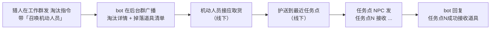

# 其他 NPC 指南（露水 NPC / 机动人员 / 跟组辅导员）

> 本指南覆盖除「猎人」「任务点 NPC」之外的三类工作人员角色。
> 关键边界：**只有露水 NPC 有 bot 指令**；机动人员、跟组辅导员是**线下角色，不向系统发任何指令**，仅做物理/记录工作。

## 0. 角色总览

| 角色 | 是否有 bot 指令 | 工作群发指令？ | 核心职责 |
|---|---|---|---|
| 露水 NPC | ✅ 有（与猎人相同格式） | ✅ 是 | 携带露水，可被玩家用功能卡；**不淘汰玩家** |
| 机动人员 | ❌ 无 | ❌ 否 | 把猎人淘汰玩家获得的道具，护送到最近任务点 |
| 跟组辅导员 | ❌ 无 | ❌ 否 | 跟在玩家后记录 / 拍摄，遇意外及时上报 |

> 与猎人、任务点 NPC 的关系：猎人指令见《猎人指南》，任务点 NPC 指令见《任务点 NPC 指南》。本指南只讲上面三类。

---

## 1. 露水 NPC

### 1.1 职责

- 身上**携带露水**，在场地内游走。
- 玩家可使用**静止卡 / 护盾卡**对付露水 NPC（格式与猎人完全相同），但露水 NPC **没有淘汰玩家的功能**——它不会被触发去淘汰任何人。


### 1.2 指令格式（与猎人相同）

露水 NPC 在工作群发出的指令，格式与《猎人指南》中「玩家对猎人使用功能卡」一致：

```
猎人Y被使用静止卡 [获得线索N]
猎人Y被使用护盾卡
```

> 系统层面**不单独登记**露水 NPC，把它当作「带露水的猎人」处理（去名单化）：靠工作群成员准入保证身份，系统不校验发送者是否为登记的露水 NPC。详见《任务点 NPC 指南》§6 的去名单化说明。

### 1.3 与猎人的区别

| 维度 | 猎人 | 露水 NPC |
|---|---|---|
| 能否淘汰玩家 | ✅ 能 | ❌ 不能 |
| 身上携带 | 道具 / 线索 | 露水 |
| 被功能卡作用 | 静止 / 护盾 | 静止 / 护盾（相同格式） |

### 1.4 注意事项

- 露水 NPC 被使用静止卡若带 `获得线索N`，线索同样会送出（与猎人逻辑一致）。
- 露水 NPC 不参与「淘汰带道具 → 召唤机动人员」链路（因为它不淘汰玩家）。

---

## 2. 机动人员

### 2.1 职责

- **道具搬运**：当猎人淘汰玩家、获得玩家身上的道具后，由机动人员把道具从淘汰现场**护送到最近的任务点**，交任务点 NPC 入库。

### 2.2 触发与流转（无指令，纯线下 + bot 广播）

机动人员**不向系统发任何指令**，整条链路靠 bot 在后台群广播 + 线下接应：



### 2.3 说明

- 机动人员的「召唤」来自猎人淘汰指令里的「召唤机动人员」字样（见《猎人指南》），bot 据此在后台群播报，机动人员看到后线下行动。
- 道具最终**必须由任务点 NPC 用「接收」指令入库**，系统状态才更新。机动人员本身不碰系统。

---

## 3. 跟组辅导员

### 3.1 职责

- **跟队记录**：跟在玩家小队后面，记录游戏过程、拍摄素材。
- **异常上报**：玩家出现意外 / 冲突 / 身体不适等状况时，第一时间上报。

### 3.2 上报方式（无指令）

- 跟组辅导员**不向系统发任何指令**。
- 遇异常建议走**后台群**口头 / 文字上报，或直接联系管理员处理。
- 上报内容：所在位置、涉及玩家 / 小队、异常类型、已采取的措施。

### 3.3 说明

- 跟组辅导员是「观察 + 保障」角色，不参与任何数据录入；其上报属于线下沟通，不进入 bot 指令流。

---

## 4. 与其他文档的关系

- 想看猎人怎么淘汰 / 用功能卡 → 《猎人指南》
- 想看任务点怎么送出 / 接收道具 → 《任务点 NPC 指南》
- 想看玩家能做什么 → 《玩家指南》
- 指令通用格式约定 → 《通用指令》
