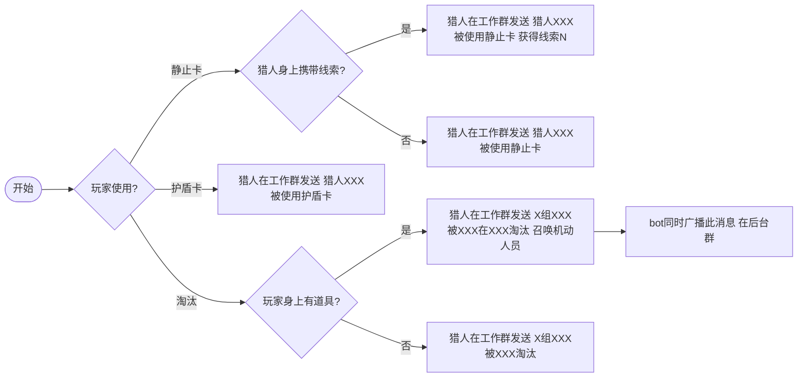

# 猎人指南

> 你是猎人（或露水 NPC）。在**工作群**发指令，系统自动校验并处理。
> 指令格式以本指南为准；通用格式约定见《通用指令规则》。

## 1. 你是谁

- 猎人负责追击寻露者，按规则将其淘汰。
- 部分猎人同时是「露水 NPC」，可被静止卡送出线索。

## 2. 指令一览

### 2.1 淘汰玩家（无道具）

```
X组XXX被XXX淘汰
```

例：`1组张三被李四淘汰`

### 2.2 淘汰玩家（携带道具，需机动护送）

```
X组XXX被XXX在XXX淘汰 召唤机动人员
```

例：`1组张三被李四在学校淘汰 召唤机动人员`

> 带「召唤机动人员」时，bot 会额外把这条消息广播到**后台群**，便于机动人员接应。

### 2.3 静止卡（可送出线索）

```
猎人Y被使用静止卡
猎人Y被使用静止卡 获得线索N
```

例：`猎人张三被使用静止卡 获得线索5`

- 带「获得线索N」时，线索 N 置为「已发现未收集」。
- 指令里若写「获得露水X」，系统**已停用露水送出**，会忽略并告警；露水只能经任务点接收/存入或网页端编辑。

### 2.4 护盾卡（不支持获得线索）

```
猎人Y被使用护盾卡
```

例：`猎人张三被使用护盾卡`

> 护盾卡**不支持**获得线索，无论猎人身上是否有线索，都不会送出线索。

## 3. 指令流程图



## 4. 冷却规则

| 动作 | 冷却 |
| --- | --- |
| 猎人淘汰 | 20 秒（狂欢模式 40 秒） |
| 静止卡 | 180 秒（3 分钟） |
| 护盾卡 | 20 秒 |

冷却期间重复发送会被拒绝并提示剩余秒数。

## 5. 淘汰校验链

发送淘汰指令后，系统依次检查：

1. 玩家是否存在（组号 + 姓名匹配）
2. 玩家状态是否为 存活 / 复活
3. 是否处于全局任务免疫期
4. 猎人是否处于淘汰冷却

任一步不通过都会回复失败原因，不会误淘汰。

## 6. 关于身份（去名单化）

系统**不校验**发送者是否为登记的猎人——猎人名单已在设计上去掉，改为线下口头约定 + 工作群成员准入来保证身份。谁在工作群发淘汰指令，冷却就记谁的 QQ。请确保只有猎人 / 管理员能进工作群。
