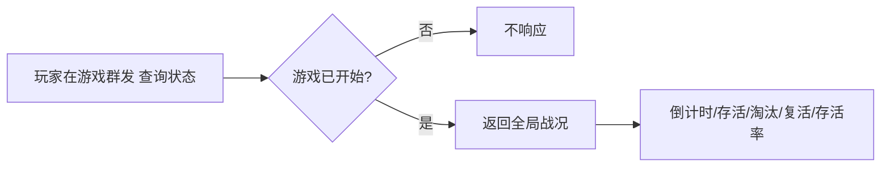

# 玩家指南

> 你是「极限挑战」中的**寻露者**。本指南帮你搞懂怎么玩、被抓了怎么办、能在群里查到什么。

## 1. 你是谁

- 你是「极限挑战」中的寻露者，与 120+ 名同伴一起组成露水收集队。
- 你所在的小组（约 10 人）有 2 名联络员（1 名对外、1 名对内），请服从他们的信息同步。

## 2. 你的目标

在限定时间内**躲避猎人追击**，通过任务点或散落信封获取**露水线索**，集齐露水并送至结算点登记。

胜利条件（同时满足）：

- 达到目标露水收集量
- 全员在规定时间内返回结算
- 场上未全员淘汰

## 3. 你的卡片

你可能会拿到以下几种卡片：

| 卡片 | 作用 |
| --- | --- |
| 线索卡 | 用於寻找该线索对应的露水 |
| 露水卡 | 寻找并运回大本营的任务物品 |
| 金露水卡 | 复活一名被猎人淘汰的玩家 |
| 静止卡 / 护盾卡 | 用于游戏中的猎人（详见《猎人指南》） |

## 4. 被抓了怎么办

- 猎人淘汰你后，你需要带上猎人给你的红布条并返回到大本营
- 你会进入「淘汰」状态，淘汰你的这名猎人将会进入20秒冷却时间

## 5. 你能查到什么

在**游戏群**发送下面这条（一字不差）：

```
查询状态
```

bot 会返回**全局战况**（注意：是当前全局数据，不是你的个人明细）：

- 倒计时
- 存活 / 淘汰 / 复活 人数
- 总人数与存活率

> 说明：当前版本玩家端只能查全局战况，看不到自己的露水/线索明细。个人数据由猎人、任务点 NPC 在工作群上报，管理员在 Web 后台查看。

## 6. 查询流程



## 7. 安全提醒

- 服从猎人与任务点 NPC 的指令格式，减少沟通误差。
- 关注游戏群广播，尤其是「免疫」「冷却」「淘汰」类提示。
- 游戏未开始时，指令不会被处理，属正常现象。
