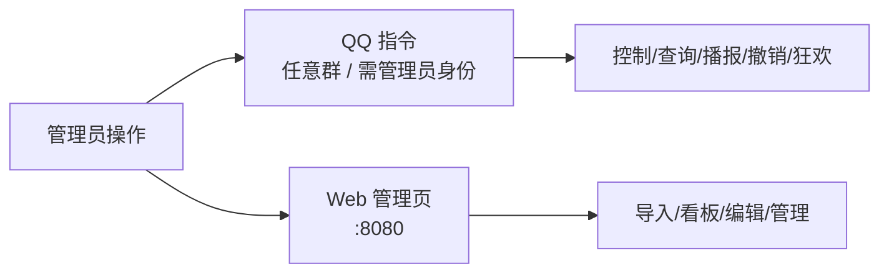

# 管理员指南

> 管理员负责部署、开局控制与现场救火。操作有两条入口：**QQ 指令** 与 **Web 管理页**。

## 1. 权限说明

- 管理指令只有**管理员 QQ**（白名单，见 `Claw/.env` 的 `ADMIN_QQ`）发送才生效。
- **不限群**——在游戏群、工作群、后台群任意一处发都行，系统只校验发送者 QQ。
- Web 管理页通过 `:8080` 访问（见第 7 节安全提醒）。

## 2. 操作入口

## 3. 快速开始（部署）

1. 双击 `setup.bat` 安装 Python 依赖，按提示下载 NapCat 到 `napcat/`。
2. 复制 `Claw/.env.example` 为 `Claw/.env`，填入 Bot QQ、三个群号、管理员 QQ。
3. 双击 `start.bat`，NapCat 窗口用 QQ 小号扫码登录。
4. 浏览器打开 `http://127.0.0.1:8080`，在管理页导入数据、开始游戏。

## 4. QQ 指令一览

| 指令 | 格式 | 用途 | 备注 |
| --- | --- | --- | --- |
| 开始 | `/开始 [分钟]` | 开始游戏 N 分钟（默认 90） | 已在进行中会失败 |
| 暂停 | `/暂停` | 暂停计时 | 未运行则失败 |
| 继续 | `/继续` | 恢复计时 | 未暂停则失败 |
| 结束 | `/结束` | 结束游戏 | 无进行中则失败 |
| 状态 | `/状态` | 查看当前战况 | 露水/金露水/玩家统计 |
| 播报 | `/播报 内容` | 自定义播报所有群 | |
| 大盘 | `/大盘` | 总览数据 | 含分组/线索统计 |
| 撤销 | `/撤销 [N]` | 撤销最近 N 次（默认 1，上限 10） | |
| 撤销指定 | `/撤销 #序号` | 撤销指定序号 | 配合 `/撤销记录` |
| 撤销记录 | `/撤销记录` | 查看可撤销列表（带序号） | |
| 狂欢 | `/狂欢` | 激活狂欢模式（线索公示 + 淘汰冷却 40s） | |
| 狂欢关闭 | `/狂欢 关闭` | 关闭狂欢模式 | |

## 5. 撤销机制详解

- `/撤销记录` 列出最近 10 条可撤销操作（带 `[序号]` 和时间）。
- `/撤销 #3` 撤销第 3 条；`/撤销` 或 `/撤销 2` 撤销最近 1 条 / 2 条。
- 单次上限 10 条。
- 适用场景：指令填错、误淘汰、任务点录错等，先 `/撤销记录` 确认再回滚。

## 6. Web 管理页

- 地址：`http://127.0.0.1:8080`
- 功能：导入总表、看板总览、玩家 / 猎人 / 任务点管理、露水 / 线索编辑、双关联处理等。
- 详细操作以页面实际显示为准。

## 7. 安全提醒（重要）

- Web API（`:8080`）**当前无认证**。因绑定 localhost、不暴露公网尚可控；一旦部署到服务器，必须先加 Token 校验（计划公开前处理，见《待修复备忘录》D1）。
- 管理员 QQ 是最高权限，请勿泄露。

## 8. 应急（崩溃 / 掉线）

- 若 bot 仍可连，先 `/状态` `/大盘` 抢救数据。
- 完全失联时，用 `应急人工统计表.` 纸质勾表人工统计，游戏后回填数据库。
- 重启：双击 `start.bat` 重新拉起 Bot + NapCat。

## 9. 备份

- 数据库在 `Claw/data/claw.db`，定期复制备份（已被 `.gitignore` 排除，不会进仓库）。
- 重要操作建议先 `/撤销记录` 确认可回滚。
