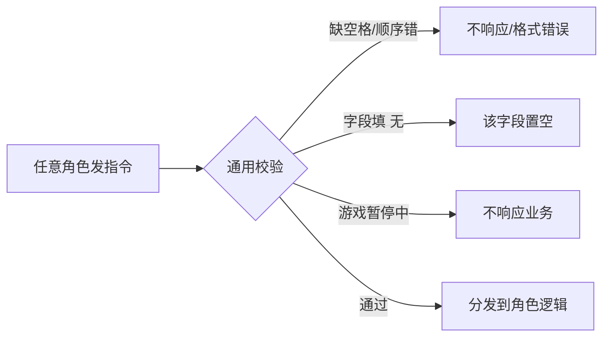

# 通用指令规则

> 所有角色（玩家 / 猎人 / 任务点 NPC / 管理员）的指令都遵循同一套格式约定。先读这一篇，再看各自角色指南。

## 1. 基本格式

- 指令各字段以**半角空格**分隔。
- 字段**顺序固定**，不要调换。
- 某字段没有内容时，用字面量 **「无」** 表示（不是留空、也不是 0）。

示例（任务点完成）：

```
任务点3 完成 线索5 露水2 金露水0 护盾卡1 静止卡0
```

其中数量为 0 的字段也可以写成「无」：

```
任务点3 完成 线索5 露水2 金露水无 护盾卡1 静止卡无
```

## 2. 游戏状态对指令的影响

- **游戏未开始 / 已结束**：玩家、猎人、任务点 NPC 的业务指令均不处理。
- **游戏暂停中**：业务指令（淘汰、功能卡、任务点）不响应；但管理员的控制指令（如 `/继续`）仍有效。
- **游戏进行中**：所有业务指令正常处理。

> 管理指令由管理员 QQ 在任意群发送，多数不受「游戏进行中」限制（`/开始` 除外，需当前没有进行中的游戏）。

## 3. 指令入口校验

每条指令进入系统后，先经过一层通用校验，再分发到对应角色的逻辑：



## 4. 常见错误

| 现象 | 原因与纠正 |
| --- | --- |
| 指令完全没反应 | 游戏未开始或已结束；先确认管理员已 `/开始` |
| 提示格式错误 | 字段顺序写反、用了中文逗号或全角空格 → 用半角空格、按固定顺序 |
| 把空缺写成 0 | 空缺用「无」；`0` 表示数量确实为 0 |
| 业务指令在暂停时不生效 | 属正常，等管理员 `/继续` |

## 5. 查询与冷却一览

- 玩家查询全局战况：`查询状态`（游戏群）
- 猎人淘汰冷却：20 秒（狂欢模式 40 秒）
- 静止卡冷却：180 秒（3 分钟）
- 护盾卡冷却：20 秒

冷却期间重复发送同类指令会被拒绝并提示剩余秒数。
